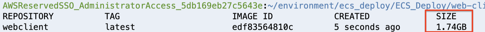
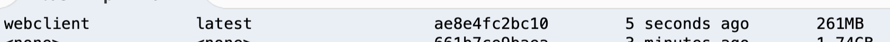

<br><br>
<br><br>
<br><br>

# Building docker images

## LAB Overview

#### In this lab you will build docker images using single and multistage building.

## Task 1: Building web-client
In this task you will bbuild web-client image using single stage building process.

1. Open your Cloud9 environment or any environment you use for this lab.
2. Clone the repository
```
git clone https://github.com/cloudstateu/ECS_Deploy.git
```
3. Enter the *web-client* directory:
```
cd ECS_Deploy/web-client/
```
4. Build docker image
```
docker build -t webclient:latest .
```
5. List available docker images:
```
docker images
```
Look into your docker image size


It's small web api application and it takes 1.74GB!

## Task 2: Building the image using multistage process.

6. Remove your current *Dockerfile**
```
rm Dockerfile
```
7. Use multistage Dockerfile to build image
```
mv Dockerfile_multi Dockerfile
```
8. Look into the file. 
We're using two steps building now. First we build our app using microsoft/dotnet:2.2-sdk image.

```
FROM microsoft/dotnet:2.2-sdk AS build
WORKDIR /app

COPY web-client.csproj .
RUN dotnet restore web-client.csproj

COPY . .
RUN dotnet publish -c Release -o out
```
Then, in the second step, bbuild atifacts are used together with smaller runtime image to create final docker image.
```
FROM microsoft/dotnet:2.2-aspnetcore-runtime AS runtime
WORKDIR /app
COPY --from=build /app/out ./
```
9. Build docker image once again using new Dockerfile
```
docker build -t webclient:latest .
```
10. List available docker images:
```
docker images
```
Now your image should be much smaller



## END LAB

<br><br>

<center><p>&copy; 2019 Chmurowisko Sp. z o.o.<p></center>