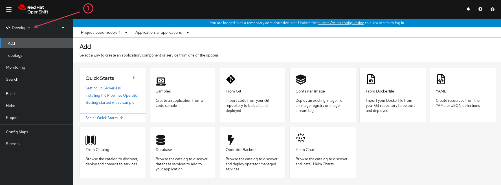
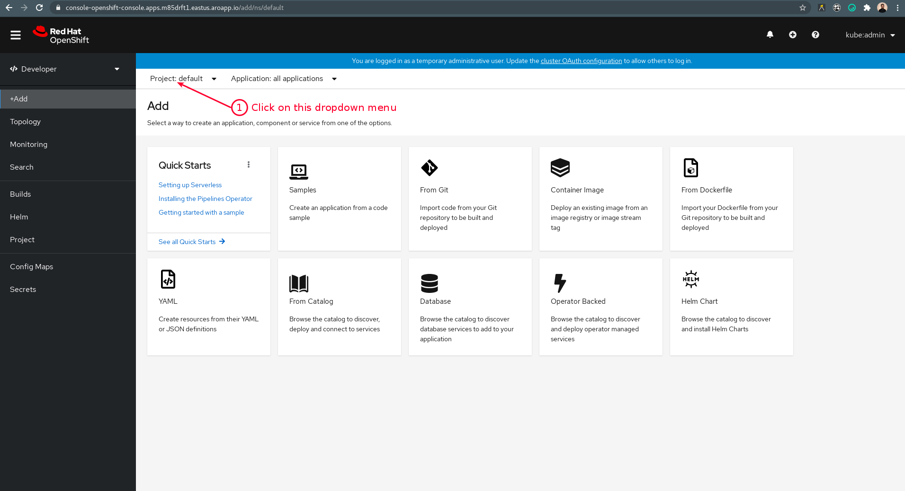
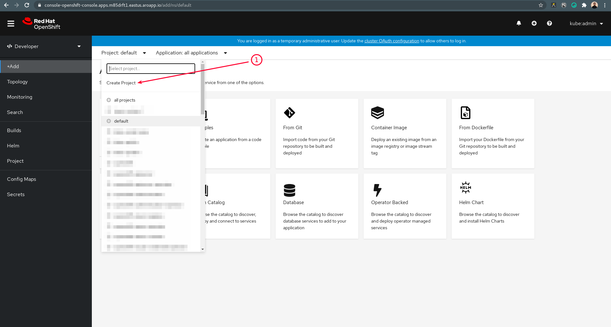
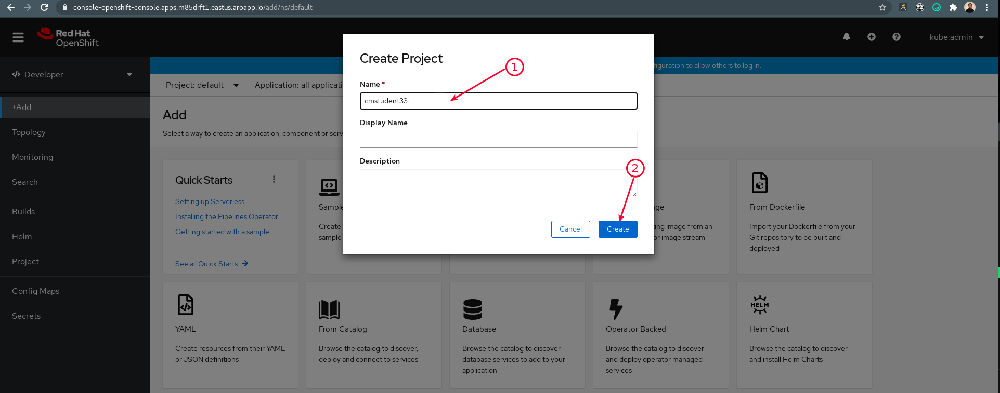
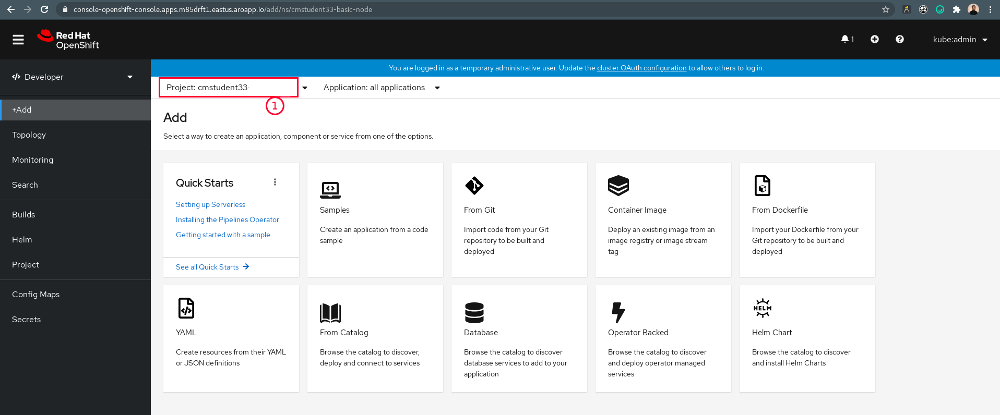
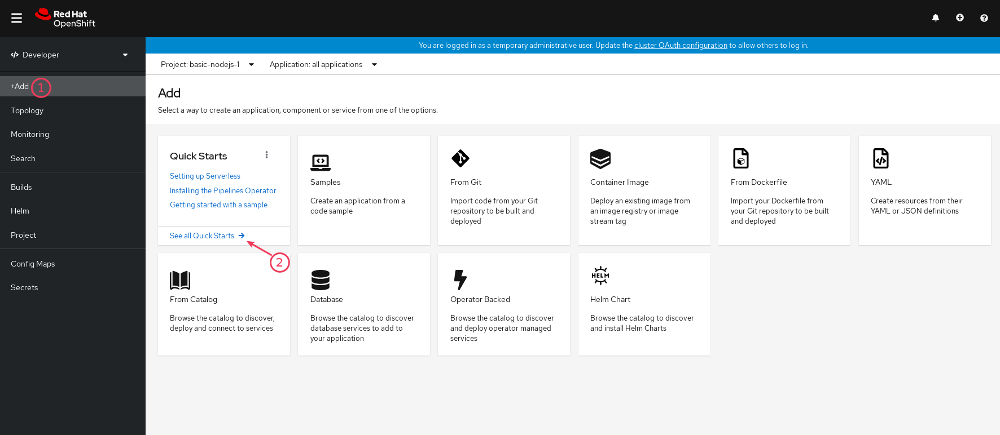
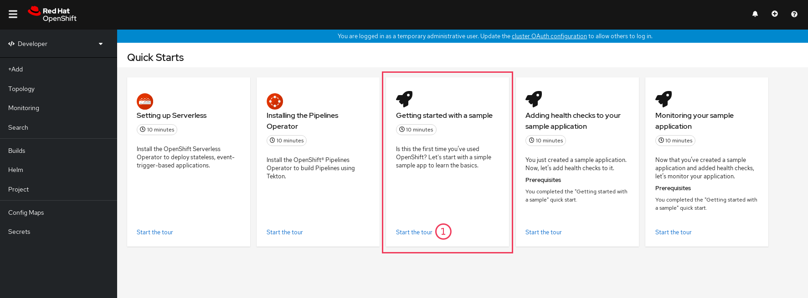

  
  
  

# Getting started

## LAB Overview

In this exercise you will explore the OpenShift basics

## 1. Start Getting Started tutorials

1.  Log into OpenShift and choose "Developer" perspective

    

1.  Create new project named `cmstudentXX-getting-started` (where `XX` is your student number)

    
    
    
    

1.  Select "+ Add" menu, click on "See all Quick Starts"

    

1.  Start with "Getting started with a sample". The OpenShift will guide you through the rest of Quick Starts

    

## END LAB

  

&copy; 2021 Chmurowisko Sp. z o.o.

