  
  
  

# Deploy an application

## LAB Overview

In this exercise you will fork a repository, create new container image and deploy an application to OpenShift.

## Requirements

1. Github account

## 1. Fork repository

1. [Sign into Github](https://github.com/login)
1. Go to [repository with sample application](https://github.com/macborowy/basic-docker-nodejs) and click on "Fork" button. Follow the Github's instructions.

   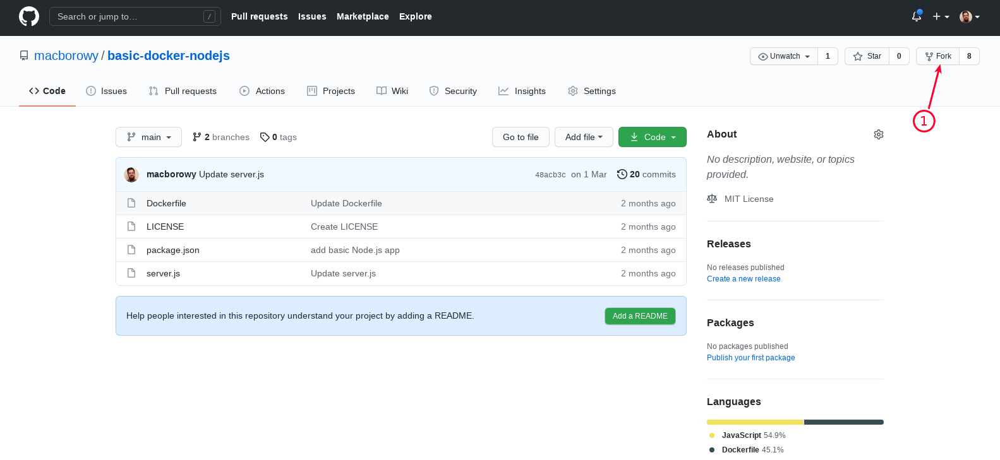

1. In a few seconds you should be redirected to your forked repository. Copy the URL.

   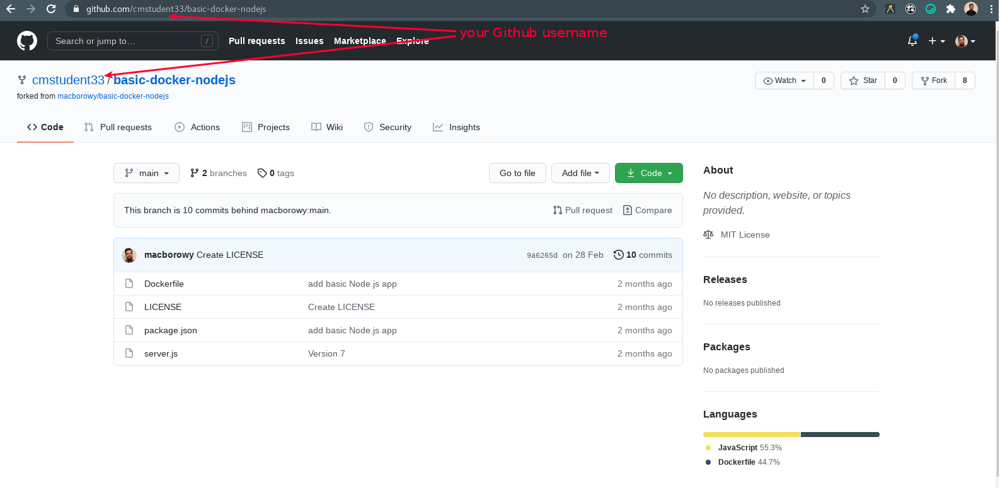

## 2. Create new application in OpenShift

1. Log into OpenShift and choose "Developer" perspective
1. Create new project named `cmstudentXX-basic-node` (where `XX` is your student number)

   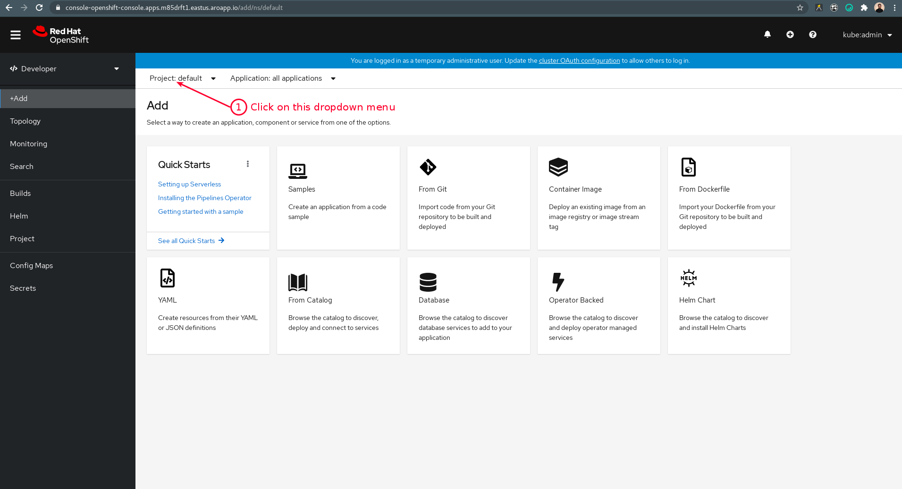
   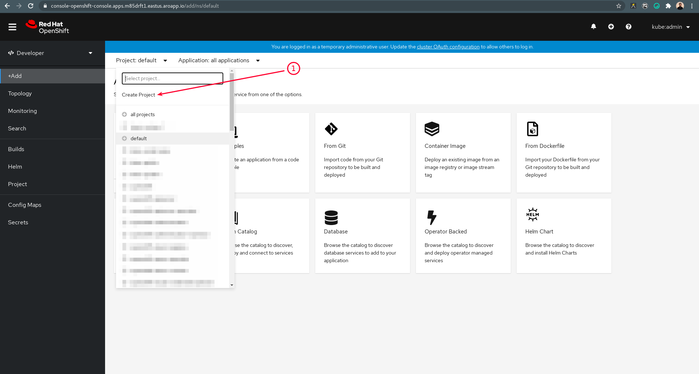
   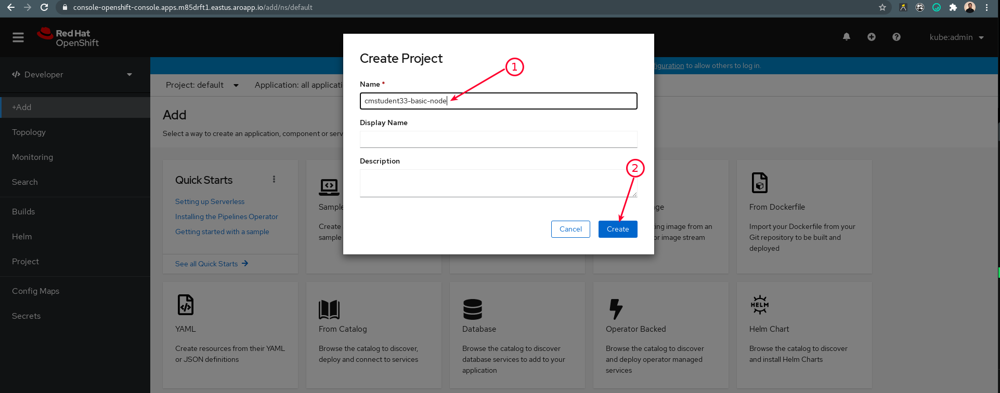
   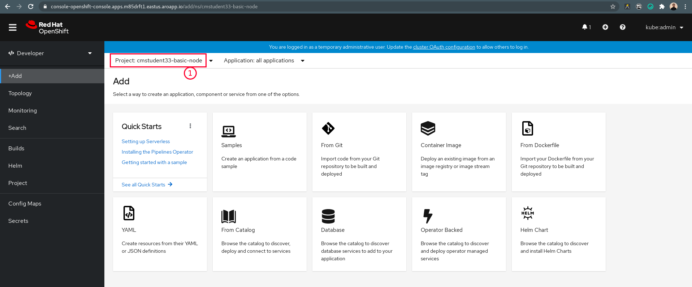

1. Click "+ Add" menu and choose "From Dockerfile"

   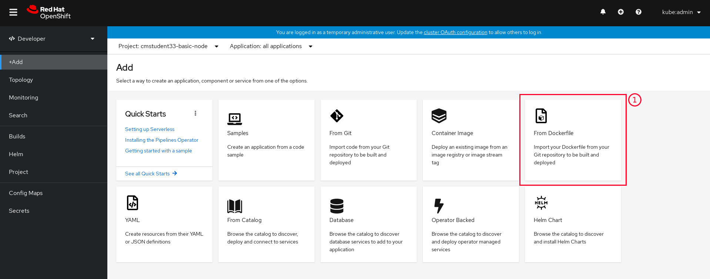

1. In "Git Repo URL" field paste your forked repository URL

   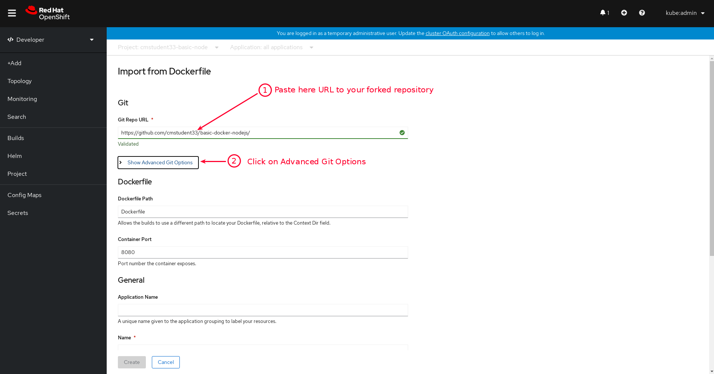

1. Set up branch name to `main` in Git Reference field

   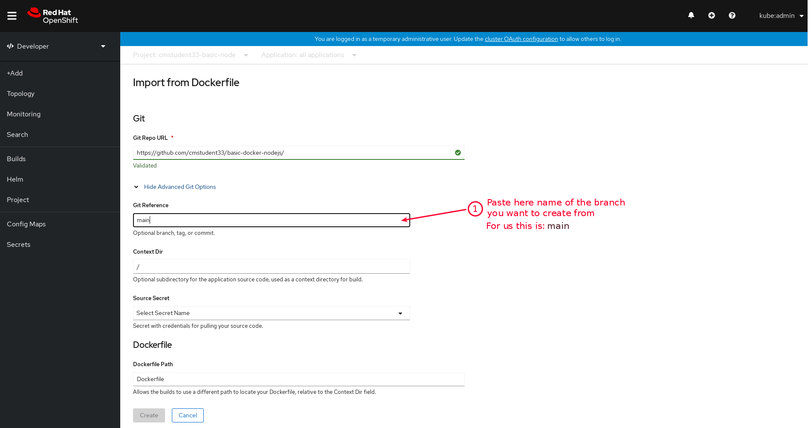

1. Give application a name (e.g.: `basic-nodejs-app`)

   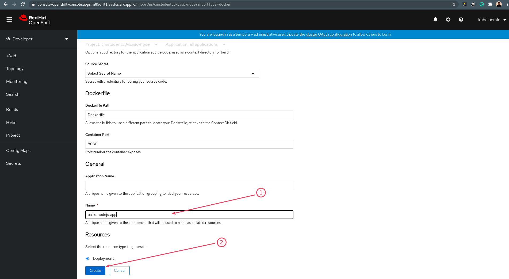

1. Check rest of the options that OpenShift has filled
1. Click "Create"

## 3. Observe application deployment and visit the application page

1. Open the Pod details. Observe Pod status and wait for it to be running.

   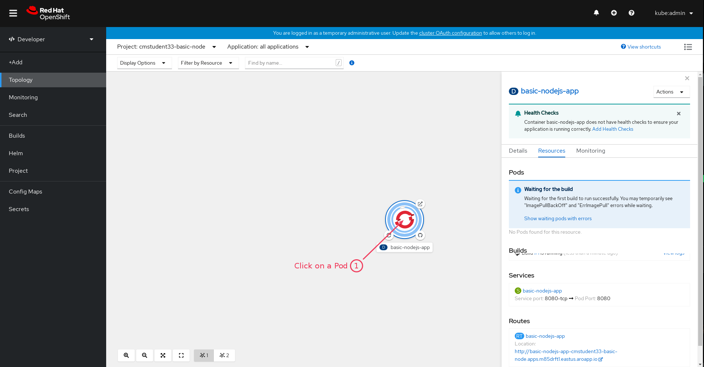

1. Visit the application and check if it is working.

   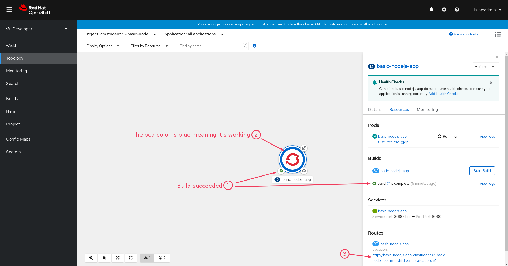
   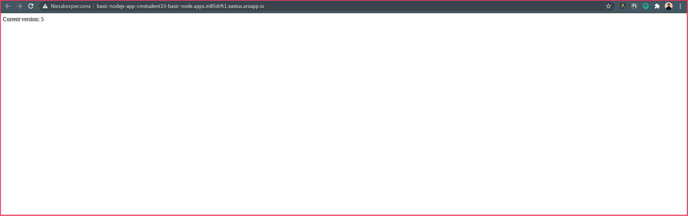

1. Paste the link to your application on a chat.

## END LAB

  

&copy; 2021 Chmurowisko Sp. z o.o.

