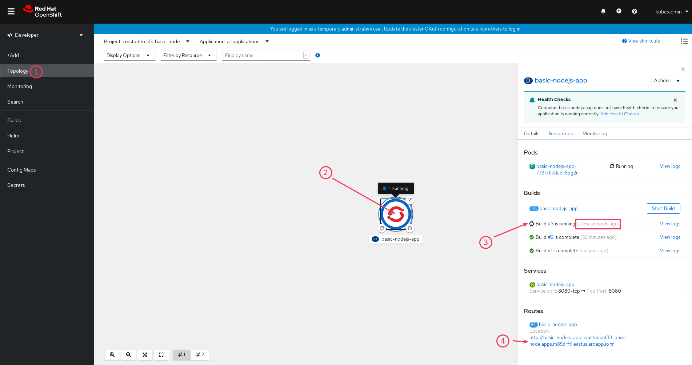

  
  
  

# Deploy an application

## LAB Overview

In this lab you will add a Build Trigger to the application from [previous lab](../11-deploy-dockerfile-application/README.md). The Build Trigger will start build as soon as code on repository change.

## Requirements

1. Github account
1. Finished [previous lab](../11-deploy-dockerfile-application/README.md)

## 1. Get the webhook URL

1. Open side menu, click on "Builds" and select Build Configuration.

   

1. On Build Configuration page scroll down and click on "Copy URL with secret" for Github.

   

## 2. Setup webhook on Github

1. Go to [Github](https://github.com/), find your forked repository and go to its settings.

   

1. Find Webhooks and click on "Add webhook"

   

1. Paste the copied URL into the "Payload URL" field, change "Content type" to `application/json`, leave "Secret" empty.

   

1. Click "Add webhook"
1. Wait few seconds and check if your webhook has green check mark. If it still grey - refresh the page.

   

## 3. Update the code

1. Go to the "Code" tab, click on `server.js` file and edit it.

   
   

1. Increment the `VERSION` variable and commit

   

## 4. Check build status in OpenShift

1. If you setup webhooks correctly you should see that the new build has started (or it is finished already a few seconds ago)

   

1. Visit the application page and check if the version has changed. Try refreshing page using `Ctrl + F5`, if the version doesn't change.

   

## END LAB

  

&copy; 2021 Chmurowisko Sp. z o.o.

