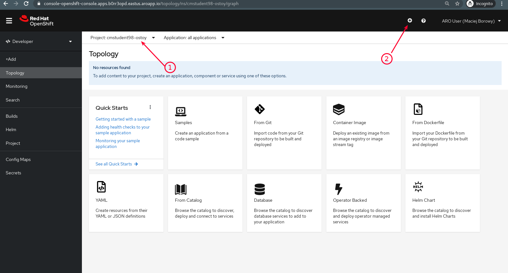
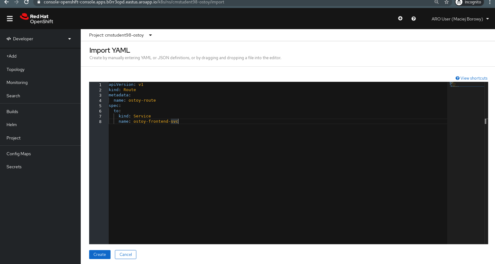
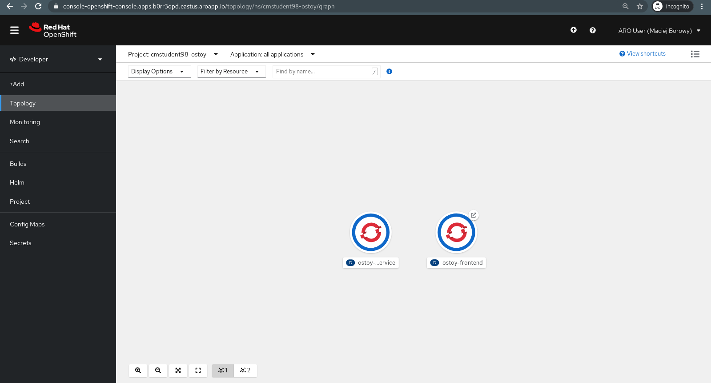
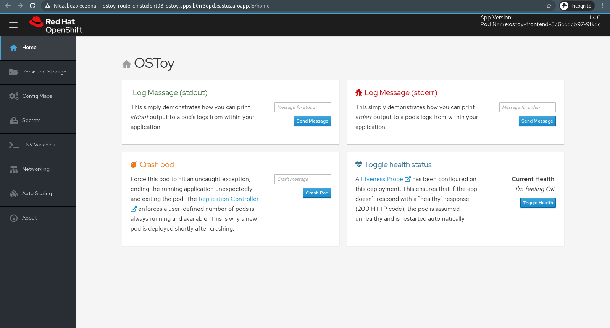
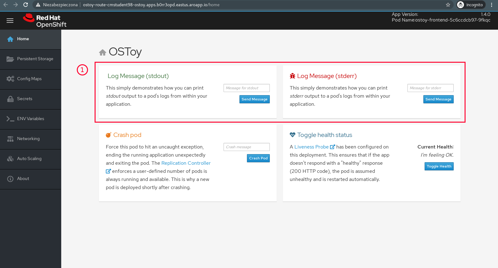
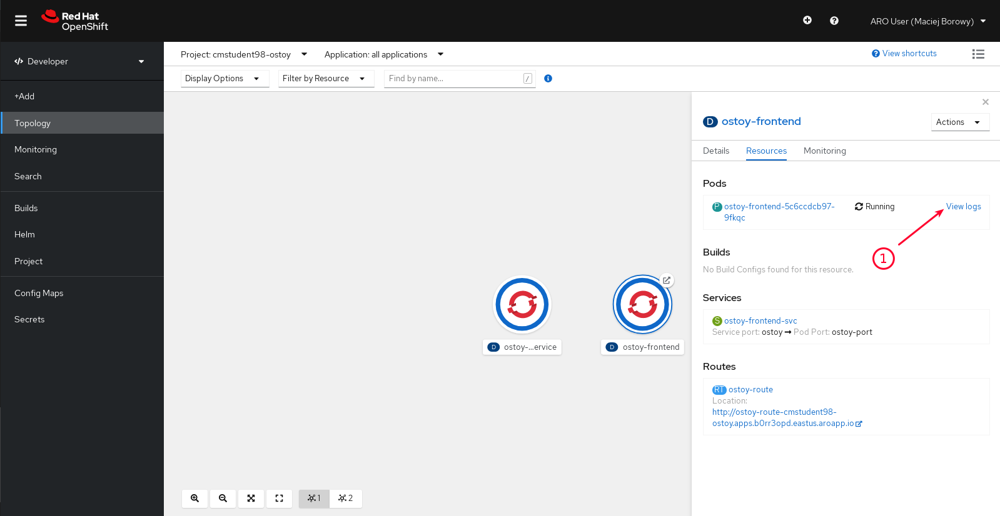

<br><br>
<br><br>
<br><br>

# OpenShift Labs

## LAB Overview

In this exercise, you will implement the "OSToy" test project (created by OpenShift Customer Success group) and see how the application logging monitor works in OpenShift.

## 1. Create new project

1. Go to "Developer" perspective, expand Projects drop-down menu and click on "Create project"
1. Name project `cmstudentXX-ostoy` (where `XX` is your student number)

## 2. Make a deploy

1. Open [`files/backend.yaml`](./files/backend.yaml)
1. Copy first part of the YAML file [`files/backend.yaml`](./files/backend.yaml) (part are separated using `---`).

   Here is the part of the file the give you an idea how it's separated:

   ```yaml
   ---
   apiVersion: v1
   kind: Route
   metadata:
     name: ostoy-route
   spec:
     to:
       kind: Service
       name: ostoy-frontend-svc
   ---
   apiVersion: v1
   kind: Secret
   metadata:
     name: ostoy-secret-env
   type: Opaque
   data:
     ENV_TOY_SECRET: VGhpcyBpcyBhIHRlc3Q=
   ---

   ```

   In this example you have 2 parts:

   ```yaml
   apiVersion: v1
   kind: Route
   metadata:
     name: ostoy-route
   spec:
     to:
       kind: Service
       name: ostoy-frontend-svc
   ```

   and:

   ```yaml
   apiVersion: v1
   kind: Secret
   metadata:
     name: ostoy-secret-env
   type: Opaque
   data:
     ENV_TOY_SECRET: VGhpcyBpcyBhIHRlc3Q=
   ```

1. Go to OpenShift, make sure you are in the correct project and click "Add YAML" button

   

1. Add each part of the file to the project (make sure copied content has correct indentation)

   

## 3. Visit application page

1. Go to _Developer_ perspective
1. Go to _Topology_ view and make sure it looks like below:

   

1. Open the `ostoy-frontend` and check if it looks like below:

   

## 4. Try OpenShift's logs monitoring feature

1. In both windows write the messages you want to see in application logs in OpenShift (e.g.: `Hello, World!`, `Hello, Error!`). After you write message press "Send Message" button.

   

1. Go back to OpenShift and open Topology view. Click on a `ostoy-frontend` Pod and explore its details. Find _"Pods"_ section, click _"View logs"_ and check Pod logs.

   

1. Check if logs contains your messages. For example:

   ```bash
   stdout: Hello, World!
   stderr: Hello, Error!
   ```

## END LAB

<br><br>

<center><p>&copy; 2021 Chmurowisko Sp. z o.o.<p></center>
