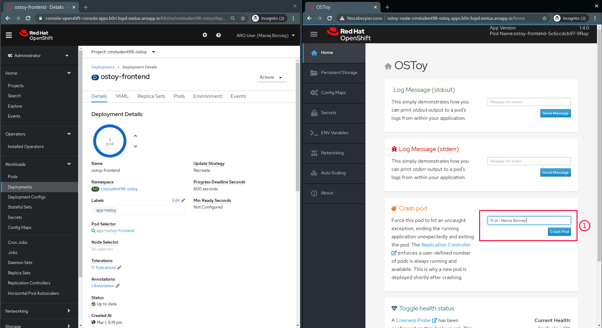

  
  
  

# OpenShift Labs

## LAB Overview

In this exercise you'll see how OpenShift reacts to Pod failures.

## Requirements

1. Complete [previous exercise](../22-view-pod-logging/README.md)

## 1. Check how OpenShift reacts to Pod failures

1. Open browser window with OpenShift next to window with OSToy application (OpenShift will react immediately - placing windows next to each other allow us to observe OpenShift reaction)

   

1. In OpenShift select Administrator perspective, go to _Deployments_ and display Deployment for `ostoy-frontend`.
1. In OSToy application use _"Crash Pod"_. Give any message you want and click _"Crash Pod"_. **Observe OpenShift window to see how OpenShift will act**.

   

1. Repeat crashing several times (3-4) and check how OpenShift will act.

## 2. Check how Liveness Probe is defined for frontend application

1. Check how Liveness Probe is implemented in [YAML file](../22-view-pod-logging/files/frontend.yaml)

## 3. Check how OpenShift will act when Liveness Probe will stop responding

1. Again - open OpenShift window next to OSToy application.
1. In OpenShift select Administrator perspective, go to _Deployments_ and display Deployment for `ostoy-frontend`.
1. Increase number of replicas to 3

   

1. In OSToy application use _"Toggle health status"_. Provide any message you want and click on _"Toggle Health"_. **Observe OpenShift window to see how OpenShift will act**. It could take a while (up to 1-2 minutes). If you don't observe any noticeable OpenShift behavior refresh the page and repeat the operation.

   

1. Go to Pods list (1). Find a Pod with name (3) matching name displayed in OSToy application (2). Open Pod details and to to "Events" tab (4).

   

1. Wait 1-3 minutes and check if failed Pod was replaced with fresh one:

   

## END LAB

  

&copy; 2021 Chmurowisko Sp. z o.o.

