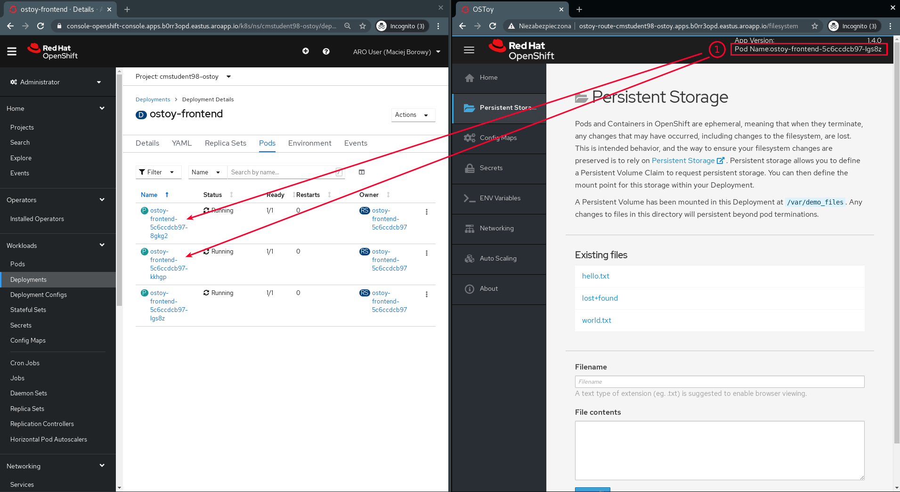
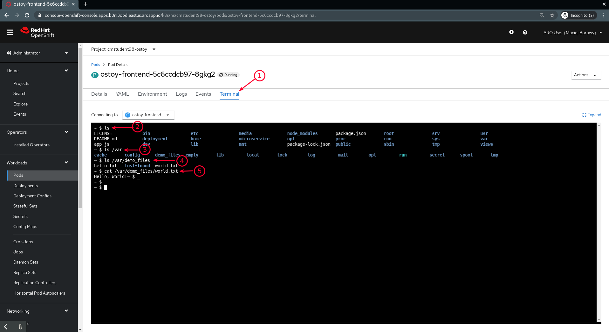

<br><br>
<br><br>
<br><br>

# OpenShift Labs

## LAB Overview

In this lab you are going to deploy test project ["OSToy"](https://github.com/openshift-cs/ostoy) (created by[OpenShift Customer Success](https://github.com/openshift-cs)) and you will see how Openshift uses Persistent Storage.

## Prerequisities

1. Finished lab `view-pod-logging`

## 1. Display _Persistent Volume Claim_

1. Go to **Administrator** perspective
1. Go to Storage > Persistent Volume Claims
1. Examinate resource details
2. Check out [OpenShift docs](https://docs.openshift.com/container-platform/4.6/storage/understanding-persistent-storage.html#pv-access-modes_understanding-persistent-storage) what is a usage of _Access Mode_ option that is attached to claim.

## 2. Add a file to Persistent Storage

1. Go to OSToy application. Go to _"Persistent Storage"_ view.
2. Add new file using the form. Choose custom name and file content.
3. Make sure that the file is on _"Existing files"_ list.

## 3. Displaying the file in pod's terminal

1. Go to Deployment _"ostoy-frontend"_. Click _"Pods"_ tav.
1. Choose a pod that is different than the one in the application

   

2. Go to "Terminal" tab i and execute the commands below. Make sure that file conetent that is displayed usgin `cat` command is correct.

   ```
   ls
   ```

   ```
   ls /var
   ```

   ```
   ls /var/demo_files
   ```

   (in the `/var/demo_files` directory there is przechowywany jest dodany z aplikacji OSToy plik)

   ```
   cat /var/demo_files/<YOUR_FILE_NAME>
   ```

   

## 3. Scaling down the deployment to 0


> In this step we want to get rid of all our pods and check that files on Persistent Storage will persist.

1. Go to Deployment _"ostoy-frontend"_ and scale it down to zero.

## 4. Scaling up the deployment to 1

> In this step we want to create new pod and make sure that the file added in step 2 exists

1. Go to Deployment _"ostoy-frontend"_ and scale it up to 1.

## 5. Display the file added in step 2.

1. Go to the OSToy app. See the _"Persistent Storage"_ view.
2. Make sure that on the _"Existing files"_ list your file exists.
3. Make sure that file content matches. 

## END LAB

<br><br>

<center><p>&copy; 2021 Chmurowisko Sp. z o.o.<p></center>
