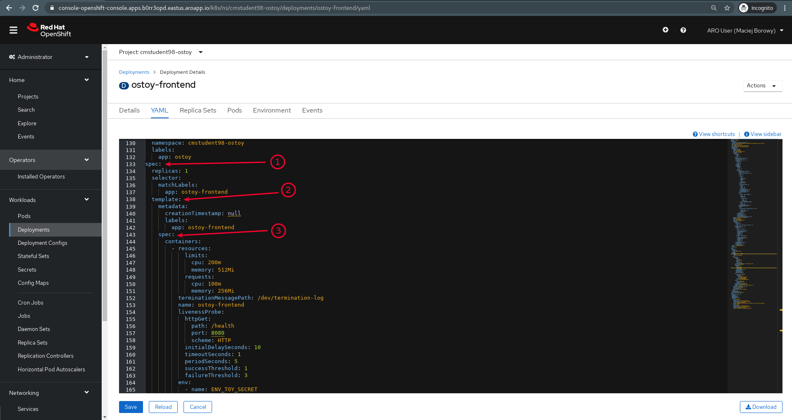
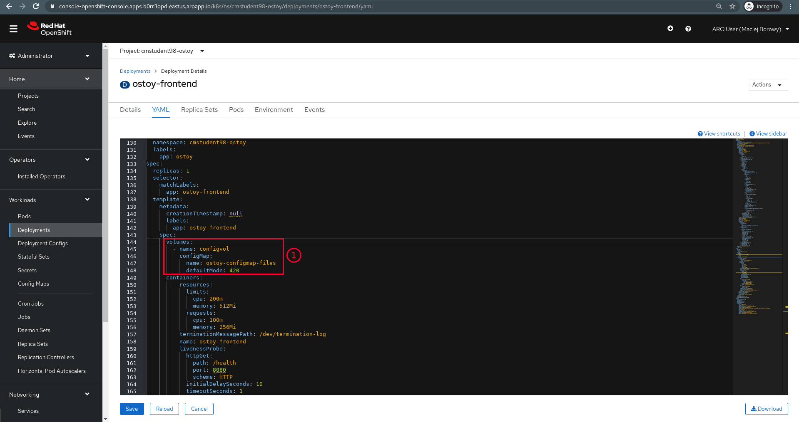
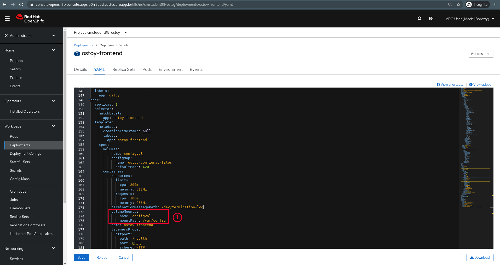

<br><br>
<br><br>
<br><br>

# OpenShift Labs

## LAB Overview

In this lab you are going to deploy a test project ["OSToy"](https://github.com/openshift-cs/ostoy) (created by [OpenShift Customer Success](https://github.com/openshift-cs)) and you will see how does OpenShift use _Config Maps_, _Secrets_ and environment variables.

## Prerequisites

1. Ukończenie lab `02-view-pod-logging`

## 1. Add ConfigMap

1. Go to the Developer perspective
1. Go to Config Maps. Click _"Create Config Map"_.
1. Replace the yaml with the content below:

   ```yaml
   kind: ConfigMap
   apiVersion: v1
   metadata:
     name: ostoy-configmap-files
   data:
     config.json: '{ "default": "123" }'
   ```

## 2. Add ConfigMap to Deployment `ostoy-frontend`

1. Go to Administrator perspective
1. Go to Deployment _"ostoy-frontend"_
1. Expand drop-down _"Actions"_ and choose _"Edit Deployment"_
2. In the YAML locate the code as on a screenshot below (or just find `volumes` section):

   

3. Add the code below in the same manner as on a screenshot below (or just fill existing `volumes` section):

   ```yaml
   volumes:
     - name: configvol
       configMap:
         name: ostoy-configmap-files
         defaultMode: 420
   ```

   

4. Add the code below in the same manner as on a screenshot below (or just fill existing `volumesMounts` section):

   ```yaml
   volumeMounts:
     - name: configvol
       mountPath: /var/config
   ```

   

## 3. Create again a pod for the Deployment `ostoy-frontend`

> In this step we want to refresh Persistent Volumes configuration that are attached to Pod. To do this wee need to delete the pod and recreate it.

1. Scale down the deployment to 0
2. Wait for scaling to finish
3. Scale up the deployment to 1
4. Wait for scaling to finish

## 4. Display the ConfigMap in the UI of the application `ostoy-frontend`

1. Check if you can display Config Map in the UI of the application `ostoy-frontend`.
2. Check if the ConfigMap contains the content from step 1:

   ```json
   { "default": "123" }
   ```

## END LAB

<br><br>

<center><p>&copy; 2021 Chmurowisko Sp. z o.o.<p></center>
